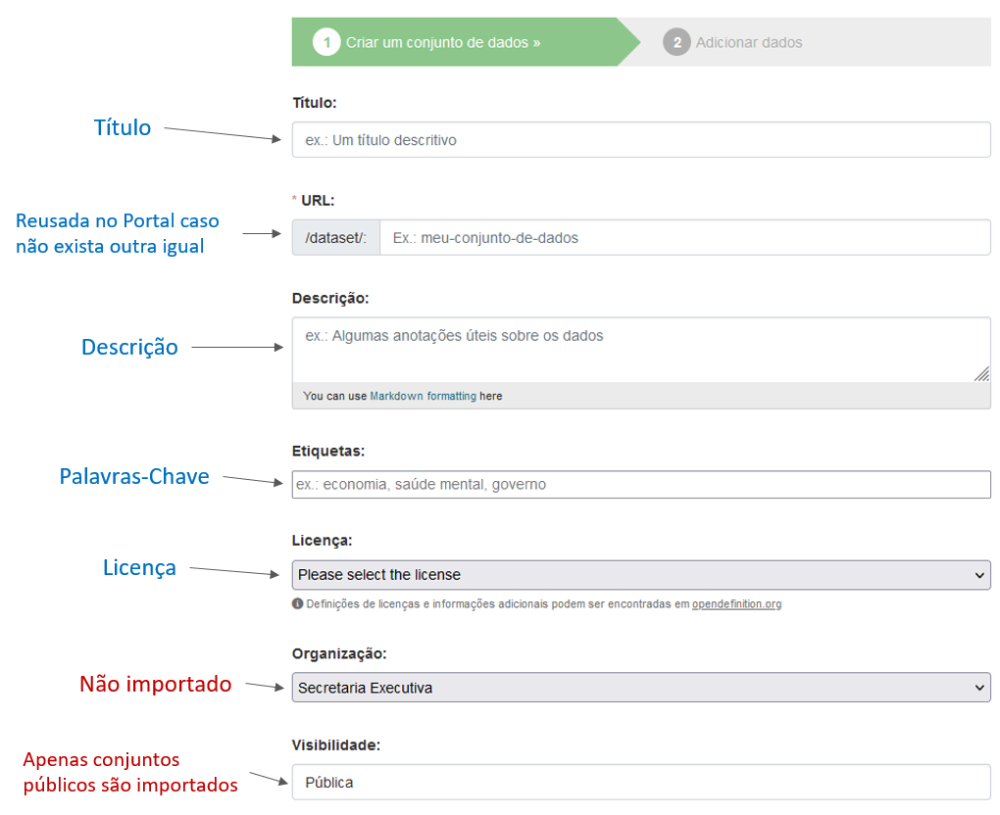
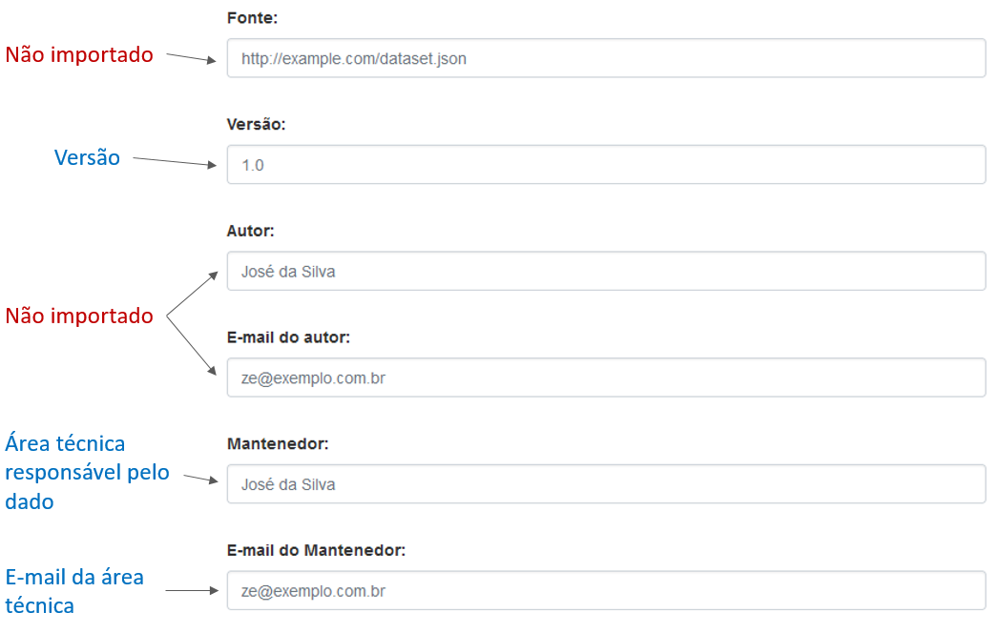
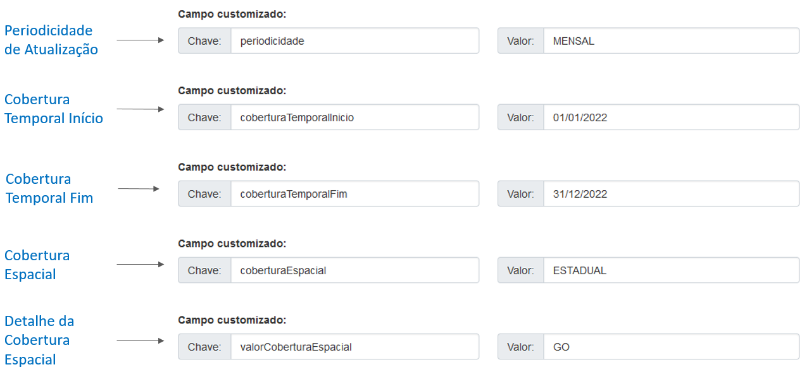
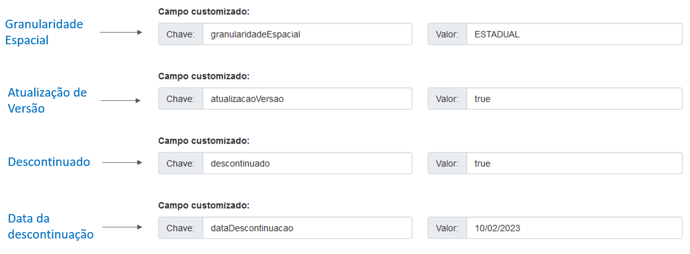
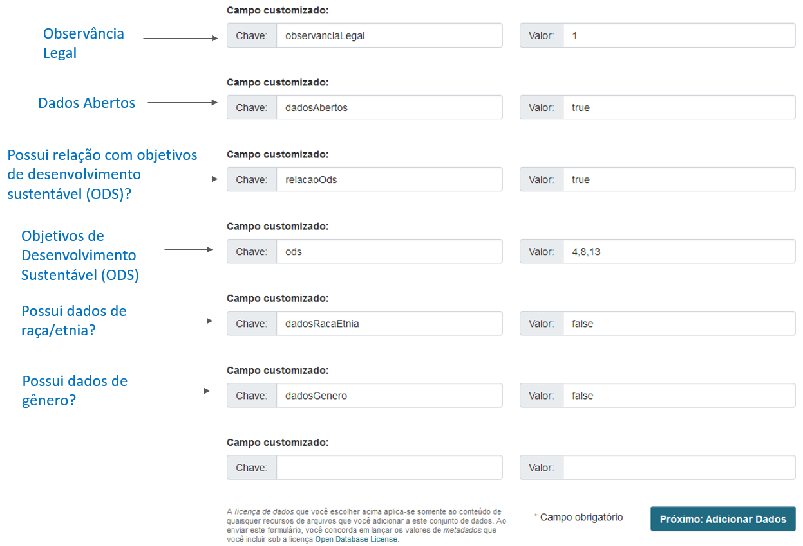

# Preenchimento dos dados no CKAN

O formulário do conjunto de dados do CKAN possui campos definidos originalmente e campos customizados.

O Portal de Dados Abertos do Governo Federal utiliza os dois tipos de campo, listados a seguir.

## Campos Originais

### Campos que mantém a mesma terminologia

Os campos a seguir tem a mesma terminologia no CKAN e no Portal de Dados Abertos, sendo de fácil identificação:
* Título
* Descrição
* Licença
* Versão

### Campos com terminologia ou comportamento diferente

1. URL

O final da URL do conjunto também terá o mesmo final no Portal, exceto se já existir um conjunto
com a mesma URL em outra organização. Nesse caso, será adicionado um número ao final da URL, para fazer a distinção.

Exemplo:
* URL no órgão: https://dados.turismo.gov.br/dataset/licitacoes
* URL no Portal: https://dados.gov.br/dados/conjuntos-dados/licitacoes
* URL no Portal caso haja outro conjunto com a mesma URL: https://dados.gov.br/dados/conjuntos-dados/licitacoes1

2. Etiquetas

As etiquetas definidas no CKAN aparecem com o nome de "Palavras-Chave" no Portal.
O significado, no entanto, é o mesmo, servindo para indicar termos associados ao conjunto de dados em questão.

3. Mantenedor

O campo mantenedor aparece no Portal com o nome de "Área técnica responsável pelo dado".

4. E-mail do Mantenedor

O campo de e-mail do mantenedor aparece no Portal com o nome de "E-mail da área técnica".

### Campos não utilizados

Os campos a seguir não são exibidos no Portal:
* Visibilidade: o Portal só importa conjuntos que estão públicos no CKAN do órgão
* Organização: por padrão todos os conjuntos do CKAN do órgão aparecerão na mesma organização no Portal, o que não impede o órgão de criar organizações no seu CKAN para representar suas sub-unidades.
* Fonte
* Autor
* E-mail do autor

## Campos Customizados

No CKAN, os campos customizados são nada mais do que pares de chave/valor que podem ser adicionados
ao conjunto de dados para incluir informações adicionais não cobertas pelos campos originais.

O Portal de Dados Abertos se utiliza desses campos customizados para obter algumas informações.
Os campos devem ser preenchidos com chave e valor exatamente como explicados a seguir.

1. Periodicidade de Atualização

* Chave: periodicidade
* Valores possíveis:
    * ANUAL
    * DIARIA
    * MENSAL
    * OUTRAS
    * QUINZENAL
    * SEMANAL
    * SOB\_DEMANDA
    * TRIMESTRAL

2. Cobertura Temporal Início

* Chave: coberturaTemporalInicio
* Valores possíveis: data no formato dia/mês/ano (dd/mm/aaaaa)

3. Cobertura Temporal Fim

* Chave: coberturaTemporalFim
* Valores possíveis: data no formato dia/mês/ano (dd/mm/aaaa)

4. Cobertura Espacial

* Chave: coberturaEspacial
* Valores possíveis:
    * FEDERAL
    * ESTADUAL
    * MUNICIPAL

5. Granularidade Espacial

* Chave: granularidadeEspacial
* Valores possíveis:
    * FEDERAL
    * ESTADUAL
    * MUNICIPAL

6. Atualização de Versão

* Chave: atualizacaoVersao
* Valores possíveis:
    * true
    * false

7. Homologado

* Chave: statusHomologacao
* Valores possíveis:
    * HOMOLOGADO
    * NAO\_HOMOLOGADO

8. Descontinuado

* Chave: descontinuado
* Valores possíveis:
    * true
    * false

9. Data da Descontinuação

* Chave: dataDescontinuacao
* Valores possíveis: data no formato dia/mês/ano (dd/mm/aaaaa)

10. Observância Legal

* Chave: observanciaLegal
* Valores possíveis: número inteiro de acordo com a relação abaixo
    * 1 -> Público
    * 2 -> Restrito - Direito Autoral (Lei nº 9.610/1998)
    * 3 -> Restrito - Informação Pessoal (Art. 31 da Lei nº 12.527/2011)
    * 4 -> Restrito - Propriedade Intelectual (software) (Lei nº 9.609/1998)
    * 5 -> Restrito - Protocolo pendente de análise de restrição (Art. 6º, III, da Lei nº 12.527/2011)
    * 6 -> Restrito - Restrição de Acesso a Documento Preparatório (Art. 7º, §3º, da Lei nº 12.527/2011)
    * 7 -> Restrito - Segredo de Justiça no Processo Civil (Art. 189 da Lei 13.105/2015)
    * 8 -> Restrito - Segredo de Justiça no Processo Penal (Art. 201, §6º, do Decreto-Lei 3.689/1941)
    * 9 -> Restrito - Segredo Industrial (Lei nº 9.279/1996)
    * 10 -> Restrito - Sigilo Comercial (Sociedades Anônimas) (Art. 155, § 2º da Lei nº 6.404/1976)
    * 11 -> Restrito - Sigilo Contábil (Art. 1.190 da Lei nº 10.406/2002)
    * 12 -> Restrito - Sigilo de nome, imagem, qualificação e demais info (Art. 5º, II da Lei 12.850/13)
    * 13 -> Restrito - Sigilo do Inquérito Policial (Art. 20 do Decreto-Lei 3.689/1941)
    * 14 -> Restrito - Sigilo do Procedimento Admin. Disciplinar em Curso (Art. 150 da Lei nº 8.112/1990)
    * 15 -> Restrito - Sigilo dos autos (Art. 7° da Resolução CNMP n° 23/2007)
    * 16 -> Restrito - Sigilo Empresarial (Art. 169 da Lei nº 11.101/2005)
    * 17 -> Restrito - Sigilo Funcional - SFC (Art. 26, §3º, da Lei nº 10.180/2001)
    * 18 -> Restrito - Sigilo por Possibilidade de Risco ou Dano (Art. 45 do Decreto nº 7.845/2012)
    * 19 -> Restrito - Sigilo Procedimento Admin. de Responsabilização (Art. 5º do Decreto nº 11.129/2022)
    * 20 -> Restrito - Sigilo Profissão do Advogado (Art. 7°, inciso II, da Lei n°11.767/2008)
    * 21 -> Sigiloso - Documento Preparatório - Sigiloso (Art. 7º, § 3º, da Lei nº 12.527/2001)
    * 22 -> Sigiloso - Informação Pessoal Sensível (Art. 31 da Lei nº 12.527/2011)
    * 23 -> Sigiloso - Reserva do Processo Ético (Art. 13 do Decreto nº 6.029/2007 e Art. 14 da Reso)
    * 24 -> Sigiloso - Segredo de Justiça no Processo Civil (Art. 189 da Lei 13.105/2015)
    * 25 -> Sigiloso - Segredo de Justiça no Processo Penal (Art. 201, §6º, do Decreto-Lei 3.689/1941)
    * 26 -> Sigiloso - Sigilo Bancário (Art. 1º da Lei Complementar nº 105/2001b)
    * 27 -> Sigiloso - Sigilo Fiscal (Art. 198, caput, da Lei nº 5.172/1966)
    * 28 -> Sigiloso - Sigilo de Acordo de Leniência (Art. 31, §1º, do Decreto nº 8.420/2015)
    * 29 -> Sigiloso - Sigilo de PAD em curso p/ servidores da CGU (Art. 150 da Lei nº 8.112/1990)
    * 30 -> Sigiloso - Sigilo do Inquérito Policial (Art. 20 do Decreto-Lei 3.689/1941)
    * 31 -> Sigiloso - Sigilo dos autos (Art. 7° da Resolução CNMP n° 23/2007)
    * 32 -> Sigiloso - Sigilo Funcional - SFC (Art. 26, §3º, da Lei nº 10.180/2001)
    * 33 -> Sigiloso - Sigilo Procedimento Administ. de Responsabilização (Art. 5º do Decreto nº 11.129/2022)
    * 34 -> Sigiloso - Sigilo Profissão de Advogado (Art. 7°, inciso II, da Lei n°11.767/2008)

11. Dados Abertos

* Chave: dadosAbertos
* Valores possíveis:
    * true
    * false

12. Possui relação com objetivos de desenvolvimento sustentável (ODS)?

* Chave: relacaoOds
* Valores possíveis:
    * true
    * false

13. Objetivos de Desenvolvimento Sustentável (ODS)

* Chave: ods
* Valores possíveis: lista de números inteiros separados por vírgula de acordo com a relação abaixo (Ex: 2,4,9)
    * 1 -> Erradicação da Pobreza
    * 2 -> Fome Zero e Agricultura Sustentável
    * 3 -> Saúde e Bem-Estar
    * 4 -> Educação de Qualidade
    * 5 -> Igualdade de Gênero
    * 6 -> Água Limpa e Saneamento
    * 7 -> Energia Limpa e Acessível
    * 8 -> Trabalho Decente e Crescimento Econômico
    * 9 -> Indústria, Inovação e Infraestrutura
    * 10 -> Redução das Desigualdades
    * 11 -> Cidades e Comunidades Sustentáveis
    * 12 -> Consumo e Produção Sustentáveis
    * 13 -> Ação contra a Mudança Global do Clima
    * 14 -> Vida na Água
    * 15 -> Vida Terrestre
    * 16 -> Paz, Justiça e Instituições Eficazes
    * 17 -> Parcerias e Meios de Implementação

14. Possui dados de raça/etnia?

* Chave: dadosRacaEtnia
* Valores possíveis:
    * true
    * false

15. Possui dados de gênero?

* Chave: dadosGenero
* Valores possíveis:
    * true
    * false

## Formulário ilustrado

As imagens a seguir mostram o formulário do CKAN indicando os campos que são tratados pelo Portal de Dados Abertos:

